<p align="center">
  
</p>

<h1 align="center">Tic Tac Toe — Pygame Edition</h1>

<p align="center">
  A beautiful, browser-playable Tic Tac Toe game built with Python & Pygame, featuring an animated gradient background and full touch support.
</p>

<p align="center">
  
  
  
  
</p>

---

## Features

- 🎨 **Animated gradient background** — smooth drifting color blobs, no numpy required
- ✖️ ⭕ **Two player** — X and O take turns on the same device
- 🏆 **Win detection** — rows, columns, and both diagonals
- ✨ **Win line animation** — golden line drawn through the winning cells
- 📱 **Touch support** — works on mobile browsers via pygbag
- 🌐 **Browser playable** — compiled to WASM with pygbag
- 🔄 **Instant retry** — tap or press R to restart after a game ends

---

## Play in Browser

> 🚀 **[Click here to play](https://soumyajyoti2005.github.io/Tic-Tac-Toe)**

---

## Run Locally

**1. Clone the repo**
```bash
git clone https://github.com/soumyajyoti2005/Tic-Tac-Toe.git
cd Tic-Tac-Toe
```

**2. Install dependencies**
```bash
pip install pygame
```

**3. Run the game**
```bash
python main.py
```

---

## Run in Browser (pygbag)

**1. Install pygbag**
```bash
pip install pygbag
```

**2. Serve locally**
```bash
pygbag .
```
Then open `http://localhost:8000` in your browser.

**3. Build for deployment**
```bash
pygbag --build .
```
Upload the contents of `build/web/` to GitHub Pages or itch.io.

---

## Controls

| Action | Input |
|---|---|
| Place X / O | Click or Tap a cell |
| Retry after game ends | Click / Tap anywhere or press **R** |
| Quit | Close the window |

---

## Project Structure

```
Tic-Tac-Toe/
├── main.py        # Game source code
├── banner.svg     # Banner image for README
├── .gitignore     # Excludes build/ and __pycache__/
└── README.md      # This file
```

---

## Built With

- [Python](https://python.org)
- [Pygame](https://pygame.org)
- [pygbag](https://pygame-web.github.io) — Python/Pygame to WebAssembly

---

## .gitignore

Make sure your `.gitignore` includes:
```
build/
__pycache__/
*.pyc
```
This keeps the pygbag build cache out of your repo.

---

<p align="center">Made with 💗 by Soumyajyoti Ghosh</p>

